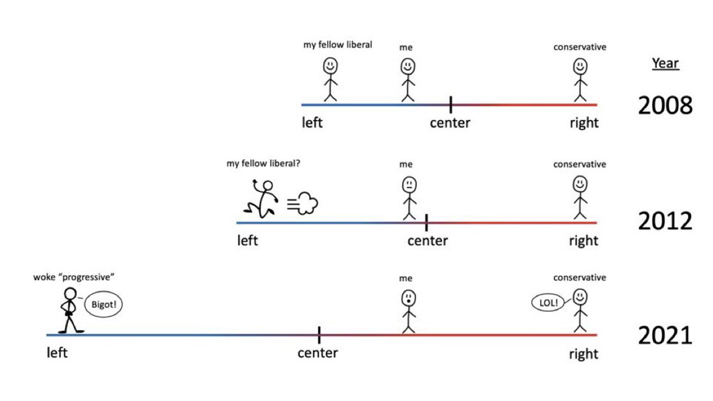
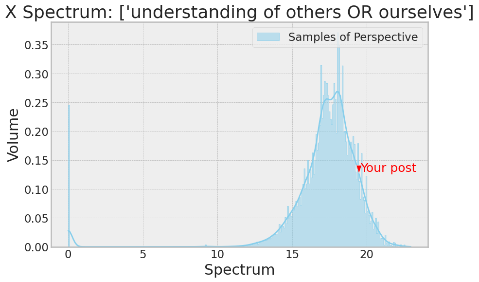

# X Spectrum Analysis

## Project Overview
The X Spectrum Analysis project aims to analyze and visualize the spectrum of X media posts to determine where they fall on a topic's distribution, whether moderate or extreme, based on vector distances among posts. This tool is instrumental in identifying trends, polarization, and bot-generated content within social media discussions.


## Installation
To set up the project locally, follow these steps:
```bash
git clone https://github.com/yourusername/x-spectrum-analysis.git
cd x-spectrum-analysis
pip install -r requirements.txt
```

## Usage
Run the script from the command line to input your social media post and view the analysis:
```bash
python X_Spectrum.py
```
If the code encounter error, try running the following code before the code was refactored:
```bash
python X_Spectrum_old.py
```
Input your X API bear token.
Input your post when prompted, and the system will provide a visualization of where your post stands in relation to others in terms of content diversity and extremity.


## Features
- **Keyword Extraction**: Utilizes the T5 model to extract keywords from user A's current post.
- **X's Full Archieved Search API**: Utilizing Keyword Search to find other users' posts to get a holistic data distribution. 
- **Vector Space Modeling**: Computes high-dimensional vector embeddings of posts using the Sentence Transformer model.
- **Distance Calculation**: Measures Euclidean distances among post vectors to analyze similarity.
- **Interactive Visualization**: Plots the distribution of posts and user A's current post to illustrate content extremity.
- **Surprising Functionality as Bot Detection**: Identifies bot-generated spam content based on the zero or low vector distance of posts. (contents with extremely similar semantic content)

## Real Time Compute
Once the Keyword Extraction and Vectorization models are loaded onto GPU, the visualization can be done on a batch of user posts in real time (~18 sec from user input post to output visual) on a T4 GPU.
The two models can take up to ~11 G of RAM.

## Output
In the output plot, we can see where our input post is relative to a batch of platform posts. 
In addition, we see that the left shows a spike of zero distance posts. (Most, if not all, of these are spam - where the vector distance distribution is differ from the rest of the platform posts)



## Contributing
Contributions are welcome! For major changes, please open an issue first to discuss what you would like to change. Please ensure to update tests as appropriate.

## Credits
- T5 Transformers by Hugging Face for keyword extraction: https://huggingface.co/Voicelab/vlt5-base-keywords 
- Sentence Transformers for generating post embeddings: https://huggingface.co/mixedbread-ai/mxbai-embed-large-v1
- Seaborn and Matplotlib for visualization.

## License
Distributed under the MIT License. See `LICENSE` for more information.

---

